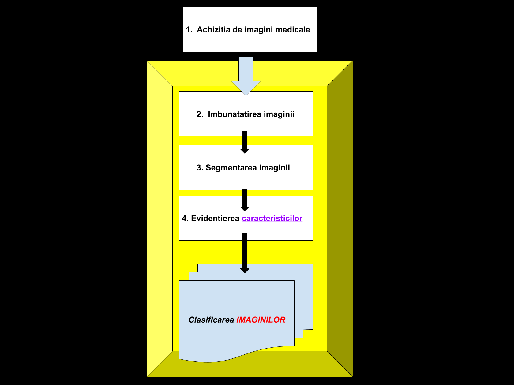

 <h1>Segmentarea Imaginilor Medicale

 
  
 ## Proiect - Overview:
 - ### Obiectivul principal al proiectului nostru:
 - [ ] Dezvoltarea unui sistem automat de segmentare a imaginilor medicale pentru a asista diagnosticarea rapida si precisa a diverselor organe. 
  
- ### Descriere generala:
- [ ] Ne propunem sa implementam un sistem de inteligenta artificiala capabil sa analizeze si sa segmneteze si sa clasifice diferite organe conform unor RMN-uri . Sistemul va utiliza tehnici avansate de deep learning pentru a invata pattern-uri si caracteristici specifice diferitelor afectiuni medicale.
  
- ### Tehnologii utilizate pentru implementare:
- [ ] Python cu framework-uri de deep learning(TensorFlow/PyTorch)
- [ ] Monai si OpenCV pentru procesarea imaginilor
   
 ## Tabel cu analiza literaturii de specialitate</ins>:
   
| Autor(i)/An | Tilul Articolului/proiectului | Aplicatie/Domeniu | Tehnologii utilizate | Metodologie/Abordare | Rezultate | Limitari | Comentarii Suplimentare |
|-------------|------------------------------|-------------------|----------------------|----------------------|-----------|----------|-------------------------|
| Yating Ling, Yuling Wang, Wenli Dai, Jie Yu, Ping Liang, and Dexing Kong - 2024 | MTANet: Multi-Task Attention Network for Automatic Medical Image Segmentation | Medical | Unet, DenseUNe,Unet++ | determinarea si atribuirea unor tichete imaginilor de la un set fix | 95.05%(PVTv2) 91.24%(mIoU)//with PVT backbone | nu se poate utiliza pe imagini 3D | * |
| Chao Liang si Shaojie Xin - 2020 | Research Status and Prospects of Deep Learning in Medical Images | Medical | Deep Learning, RNN(recurrent neural network), CNN(convolutional neural network), DBN(Deep Confidence Network) si Auto Encoder | diagnosticarea asistata de calculator ce analizeaza automat imagini medicale | 95.22% scor DICE pentru segmentare de ficat, 64.4% scor DICE pentu segmentari de tumori la ficat (mai mare decat 3.3% decat nivelul mediu de performanta) | calitatea si cantitatea datelor, generalizarea si adaptabilitatea modelelor folosite | * |
| Andreas S. Panayides, Amir Amini, Nenad D. Filipovic, Ashish Sharma, Sotirios A. Tsaftaris, Alistair Young, David Foran, Nhan Do, Spyretta Golemati, Tahsin Kurc, Kun Huang, Konstantina S. Nikita, Ben P. Veasey,Michalis Zervakis,Joel H. Saltz, and Constantinos S. Pattichis -2020 | AI in Medical Imaging Informatics: Current Challenges and Future Directions | Medical | TMA(Tissue Microarray), HIT(Healthcare Information Technology), PET(Positron Emission Tomography) | Analiza informatiei si verificarea acesteia cu experiente anterioare | 90% acuratete pentru segmentarea cancerului, 80% in prezicerea unei mutatii genecice | Limitari de date si costuri mari pentru realizarea infrastructurii | * |
| Dhruv Sharma, Shuchi Singh, Dr. Meenakshi R. Patil, Abdus Subhan | Medical Image Processing, Disease Prediction and Report Summarization using Generative Adversarial Networks and AIML | Medical | GAN(Generative Adversial Networks), Cloud Computing, RNN(Recurrent Neural Networks), CNN (Convolutional Neural Network) | Compilarea si Preprocesarea setului de date | peste 90% acuratete in indentificarea si prezicerea bolilor | Interpretarea si fiabilitatea programului | * |
| Shankar Shambhu, Prasenjit Das, Karan Bajaj, Mukesh Kumar | Recent Trends of Granular Computing Approaches for Image Processing in Medical Imaging | Medical | GrC(Granular Computing), Image Processing Techniques | Analiza informatiei prin granular calculation si image segmentation | spatiul de stocare, procesarea, imagini in miscare | * |

  

## Figura cu arhitectura propusa:
  

 

  

## Schema bloc - detaliere:

- ### 1 - <ins> Achizitia de imagini medicale </ins>
- [ ] Pentru a putea începe tot procesul de analizare și computerizare sunt necesare imaginile care ne ajuta sa extragem informațiile de care avem nevoie pentru a putea trage o concluzie cât mai corectă.
  

- ### 2 - <ins> Imbunatatirea imaginii </ins>
- [ ] Imbunatatirea imaginii este procesul prin care se creste calitatea unei poze. Acest proces ajuta la corectarea anumitor defecte sau probleme ale input-ului pentru obtinerea mai exacta a informatiilor oferite de catre imagine. Tehnicile cele mai des intalnite sunt cresterea contrastului, sharpness-ului, saturatia sau scaderea zgomotului si blur-ului. Exista multe alte moduri pentru cresterea claritatii unei imagini, iar acestea sunt folosite in functie de datele (imaginile) folosite. Metodele mentionate mai devreme se pot aplica manual sau cu ajutorul anumitor aplicatii specifice (ex. OpenCV, Monai).
  

- ### 3 - <ins> Segmentarea imaginii </ins>
- [ ] Segmentarea imaginii este partea in care transformam imaginea noastra in asa fel incat este inteleasa de calculator cat mai eficient. Procesul din spatele acestei metode este impartirea pozei in grupuri mai mici de pixeli pentru a putea diferentia background-ul sau identificarea unui obiect.
  

- ### 4 - <ins> Evidentierea caracteristicilor </ins>
- [ ]  Evidentierea caracteristicilor consta in scoaterea in evidenta a partilor relevante dintr-o imagine pentru a putea analiza si interpreta informatiile rezultatului (in cazul proiectului, detaliile care pot ajuta la segmentarea corecta a organului cautat).
  

- ### 5 - <ins> Clasificarea imaginilor </ins>
- [ ]  Dupa adunarea tuturor informatiilor necesare pentru realizarea unei concluzii cat mai corecte se specifica tipul imaginii dupa anumite criterii bine definite (segmentare de ficat, de inima, etc.)
  
## Bibliografie:
- https://ieeexplore.ieee.org/document/9985621 [cel mai relevant]
- https://ieeexplore.ieee.org/document/10255649
- https://ieeexplore.ieee.org/document/9258822
- https://ieeexplore.ieee.org/document/9103969
- https://ieeexplore.ieee.org/document/10692015
- https://ieeexplore.ieee.org/document/10537664
- https://docs.monai.io/en/stable/api.html
